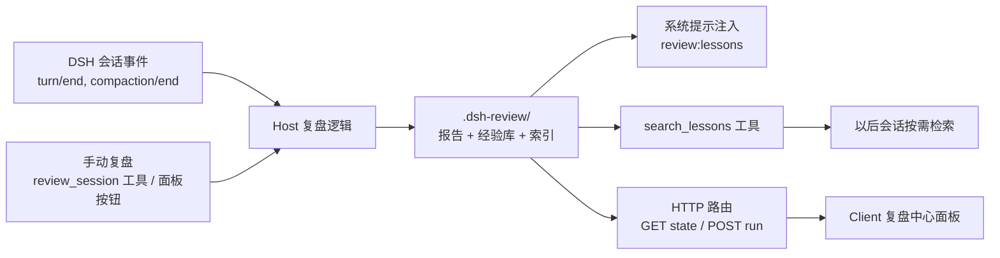

# dsh-review 插件设计文档（会话复盘 + 经验沉淀）

> 日期：2026-08-16
> 状态：设计已确认，待实施
> 目标框架：DeepSeek Harness（DSH）0.1.0-rc.6，SESSION_FORMAT_VERSION = 0

## 1. 目标与定位

本插件是 DeepSeek Harness（DSH）的「会话复盘与经验沉淀」插件。它在一轮 Agent 工作结束后，生成一份人类可读的复盘报告，并把本轮提炼出的经验条目沉淀到工作区经验库，供以后的会话复用。

核心定位是「复盘插件」，不是「记忆插件」。现有记忆类插件（dsh-mneme、dsh-mnemon、EchoCore、dsh-persona-memory）已经在做跨会话偏好/事实/记忆提取与注入；本插件的差异化在于：

- 复盘报告是第一产出物，回答「这一轮 Agent 干了什么、改了什么、哪些地方值得注意」；
- 经验库聚焦 `pitfall`（坑）、`decision`（决策）、`pattern`（可复用做法），不是通用偏好或事实；
- 复盘报告与经验库形成闭环：报告给人看，经验给以后的会话用。

## 2. 范围

### v1 范围内

- 纯本地单 profile 使用，数据落在当前工作区。
- Host 面：会话事件监听、复盘生成、经验检索、系统提示注入、HTTP 路由。
- Client 面：复盘中心面板，浏览报告、管理经验库、手动触发复盘。
- 复盘报告：中文，含摘要、改动文件、关键决策点、报错/卡点、经验条目。

### v1 范围外

- 多 profile / 多用户鉴权与云端同步。
- 语义向量检索（v1 用关键词/标签检索）。
- 复用或迁移现有记忆插件的格式。
- 复盘提示词的图形化配置界面。

## 3. 总体架构

一个 npm 包同时承担 host bundle 和 client bundle：



两端分工：

- Host 面（Node）：注册工具、监听会话事件、调用 LLM 生成复盘、读写文件、注入系统提示、暴露 HTTP 路由。
- Client 面（浏览器）：复盘中心 UI，通过 host 的 HTTP 路由读写数据和触发复盘。

浏览器不能直接读宿主机文件系统，因此前端的所有数据访问和触发动作都走 host 暴露的 HTTP 路由。

## 4. 文件结构与数据模型

数据统一存放在工作区 `.dsh-review/`，根目录通过插件配置 `stateDir` 指定（默认 `.dsh-review`）：

```text
.dsh-review/
├── reports/<session-id>.md   # 每个会话一份复盘报告
├── lessons.json              # 结构化经验库，注入与检索的源
├── lessons.md                # 人类可读投影
└── index.json                # 报告与经验的元数据索引，供前端列表和注入使用
```

经验条目字段：

```text
id             string   唯一 id
text           string   一条可直接复用的经验
kind           enum     pitfall | decision | pattern
tags           string[] 可检索标签
sourceSessionId string  来源会话
createdAt      string   ISO 时间
updatedAt      string   ISO 时间
```

报告元数据索引条目字段：

```text
sessionId  string
path       string   报告文件相对路径
createdAt  string
updatedAt  string
```

## 5. Host 面设计

### 5.1 插件形态与服务注入

采用函数插件形态，命名导出 `name` / `inject` / `Config` / `apply`，参考 dsh-agent-teams 的可用实现。`Config` 使用 `@deepseek-ai/schemastery` 的 `Schema.object` 定义：

```ts
export const name = 'dsh-review'
export const inject = [
  'tools',
  'sessions',
  'systemPrompt',
  'llm',
  'webServer',
  'workspaceRegistry',
]

export interface Config {
  stateDir: string
  maxInjectedLessons: number
  injectionBudgetChars: number
  autoReviewOn: 'turn-end' | 'compaction-end' | 'both'
}

export const Config = Schema.object({
  stateDir: Schema.string().default('.dsh-review'),
  maxInjectedLessons: Schema.number().default(5),
  injectionBudgetChars: Schema.number().default(800),
  autoReviewOn: Schema.union(['turn-end', 'compaction-end', 'both']).default('both'),
})
```

版本兼容说明：DSH rc.1 与 rc.2 之间 `webServer`/`httpServer`、`workspace`/`workspaceRegistry` 键名发生过变化。v1 以 `0.1.0-rc.6` 为目标，`inject` 直接声明当前键名 `webServer`、`workspaceRegistry`。如需兼容 rc.1，则不在 `inject` 中硬声明这两个键，改为在 `apply` 内用 `ctx.get('webServer') ?? ctx.get('httpServer')` 探测；v1 不承诺 rc.1 兼容。

### 5.2 事件监听与自动触发

监听会话事件 `turn/end` 与 `compaction/end`。具体事件名与负载字段在实现阶段以官方 `docs/subsystems/session.md` 和 `docs/persistence-catalog.md` 为准；本设计假设两者都存在，并假设能从会话日志中取到 session id、工具调用、错误、审批与注入上下文。

自动触发不是每个 turn 都复盘，满足以下任一条件才触发：

- 本轮出现文件改动；
- 本轮出现工具错误或请求错误；
- 本轮出现过审批事件；
- 发生 compaction。

触发后执行一次异步复盘，同一 session 内报告增量覆盖。复盘失败只记日志，不向主流程抛错。

### 5.3 复盘生成

复盘分两层：

1. 确定性结构化提取：用当前会话 cwd 的 `git status --porcelain` / `git diff --stat` 得到改动文件；从会话事件日志提取工具调用、错误、审批和关键决策点。当前会话 cwd 取自 agent session 的 header 或 `workspaceRegistry` 的工作区根。
2. LLM 提炼：通过 `ctx.llm` 调用模型，把结构化材料提炼成中文报告和结构化经验条目。固定提示词模板，输出严格按 JSON Schema 校验；解析失败则退化为仅结构化报告，不丢弃原始事实。

报告内容（标准档）：

- 会话摘要；
- 改动过的文件清单；
- 关键决策点（Agent 做了什么重要选择、哪些需要用户确认过、哪里可能埋坑）；
- 报错/卡点；
- 本轮提炼的经验条目。

经验条目由 LLM 输出后按第 4 节的数据模型校验并合并进 `lessons.json`，同一条目按 id 幂等更新。

### 5.4 工具契约

使用 `@deepseek-ai/dsh-tools` 的 `defineTool` 注册：

- `review_session`：对当前会话立即复盘。可选参数 `includeDetails`（默认 true）。返回报告摘要、报告路径、本次新增或更新的经验条数。
- `search_lessons`：按关键词或标签从 `lessons.json` 检索。参数 `query`（必填）、`limit`（默认 5）。返回相关经验条目列表。

工具的 description 写明「何时用、怎么用」，作为模型契约。

### 5.5 系统提示注入

通过 `ctx.systemPrompt.section()` 注册 `review:lessons` 段。注入内容只包括当前工作区相关、最近更新、且经 `injectionBudgetChars` 截断的经验摘要，不注入完整报告。完整报告由 `review_session` 或 `search_lessons` 按需读取。

「会话开始注入精简摘要 + 细节按需检索」的混合策略由两部分共同实现：系统提示注入负责精简摘要，`search_lessons` 负责细节。

### 5.6 HTTP 路由

host 通过 webServer 注册两条路由，供前端使用：

- `GET /dsh-review/state`：返回报告列表、经验库列表、当前 session id。
- `POST /dsh-review/run`：对当前会话触发一次复盘，返回最新状态。

鉴权沿用 DSH 本地单用户 Web 服务的访问控制；v1 不额外引入鉴权层。

## 6. Client 面设计

Client bundle 按 dsh-agent-teams 文档中的 client 协议组织：`src/client/index.tsx` 为浏览器入口，用 React + CSS Module，构建走 tsdown。面板挂在 `client-ui-slots` 的可用 slot 上。

三个视图：

- 报告列表：按会话时间倒序，点开查看报告正文；
- 经验库：可查看、编辑、删除、手动新增经验条目；
- 操作区：「复盘当前会话」按钮，调用 `POST /dsh-review/run`。

前端不直接访问文件系统，统一通过 `GET /dsh-review/state` 和 `POST /dsh-review/run` 交互。

## 7. 项目骨架

```text
dsh-review/
├── package.json
├── cordis.patch.yml
├── tsconfig.json
├── tsconfig.client.json
├── tsdown.config.ts
├── src/
│   ├── index.ts
│   ├── tools.ts
│   ├── events.ts
│   ├── review.ts
│   ├── lessons.ts
│   ├── state.ts
│   └── client/
│       ├── index.tsx
│       ├── ReviewPanel.tsx
│       └── ReviewPanel.module.css
└── scripts/verify.mjs
```

package.json 关键字段：

- `name`：`dsh-review`（实现前需确认 npm 可用；冲突则用 `dsh-review-journal`）。
- `type`：`module`；`main`：`lib/index.js`。
- `exports` 必须包含 `.`、`./client`、`./cordis.patch.yml`、`./package.json`，其中 `./client` 指向 `lib/client.js`。
- `dsh.bundle.patch`：`./cordis.patch.yml`；`dsh.client`：声明 `inject` 与 `platform: "web"`。
- `files` 包含 `lib`、`cordis.patch.yml`、`README.md`。
- host 侧与 client 侧依赖分别放 `peerDependencies`，运行时从 profile 的扁平 `node_modules` 解析。

cordis.patch.yml 向 host 组合插入插件行：

```yaml
- insert:
    - id: dsh-review
      name: dsh-review
```

`id` 全局唯一，`name` 必须等于包名。

## 8. 错误处理与可靠性

- 复盘逻辑在事件监听内 try/catch，失败只记日志，不影响主会话。
- 文件写入原子化：先写临时文件再 rename。
- `lessons.json` 损坏时，能从 `lessons.md` 与报告重建索引。
- LLM 输出解析失败时退化为纯结构化报告，经验库不更新，避免写入脏数据。

## 9. 验证

- 离线脚本 `scripts/verify.mjs`：验证纯逻辑与文件持久化冒烟，临时目录自清理，不启动服务。
- `dsh --profile <scratch> --dump-config`：确认插件行进入组合树。
- 手动验收：起临时 profile 跑一轮会话，确认报告与经验库生成；打开前端面板确认能列出报告、管理经验、手动复盘。

## 10. 分发与社区

- 主分发走 npm：`pnpm publish` 前构建好 `lib/`，避免 git 安装的构建授权问题。
- 仓库加 `dsh-plugin` GitHub topic。
- 发布后向 awesome-dsh-plugin 提交收录 PR。

## 11. 假设、风险与失效条件

假设：

- `turn/end`、`compaction/end` 事件存在，且会话日志可读到工具调用、错误、审批与注入上下文。
- `ctx.llm` 可在插件中调用做非 Agent 的摘要生成。
- 用户本地单 profile、单用户使用；Web 路由复用 DSH 本地访问控制。
- 报告语言为中文。

风险：

- DSH 处于开发者预览期，`SESSION_FORMAT_VERSION = 0`，官方明示会有破坏性变更。实现时锁定 rc 版本，并把事件名/键名兼容逻辑集中在一处。
- 记忆类插件拥挤，本插件若退化成「又一个记忆插件」会失去差异化。守住「复盘报告第一产出物」的定位。

失效条件：

- 若官方事件接口变化导致无法可靠拿到会话事实，自动复盘降级为仅手动 `review_session` 工具，仍保留经验库与注入能力。
- 若 `ctx.llm` 调用成本或延迟过高，v1 可先只做确定性结构化报告，LLM 提炼改为 v2。

## 12. 后续演进（非 v1）

- 语义检索经验库。
- 复盘报告的浏览器内编辑与导出。
- 按项目/工作区分库，而不是所有会话混在一个经验库。
- 与 DSH 审批/沙箱审计结合，输出更完整的「Agent 行为审计」视角。
